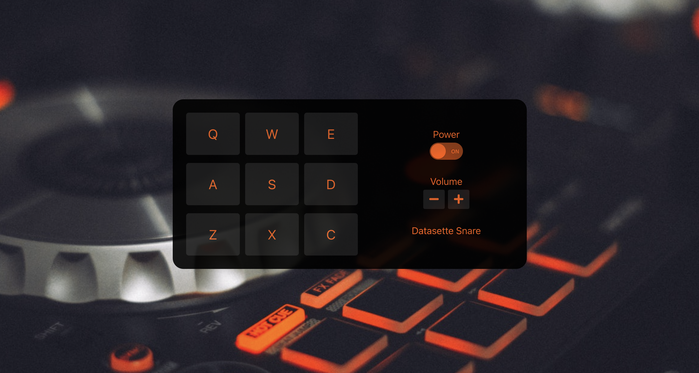
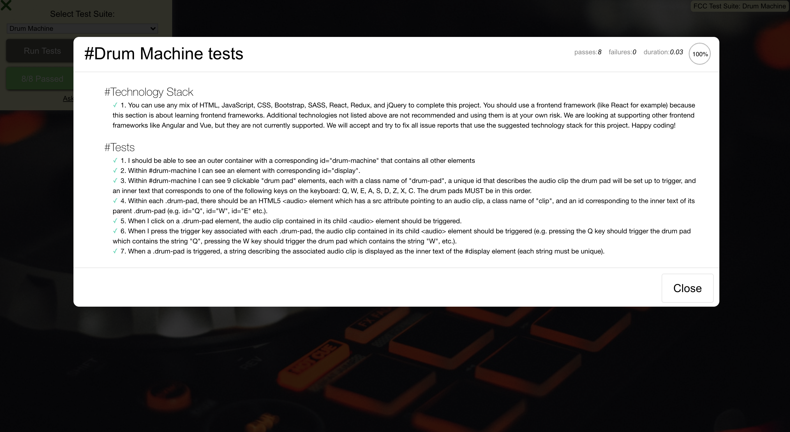

# Drum Machine

This project was created using React, Redux, HTML, CSS.

Deployed on github pages - [Check It Out]()

## What it is

A drum machine project from [freecodecamp's frontend certification](https://www.freecodecamp.org/learn/front-end-development-libraries/front-end-development-libraries-projects/build-a-drum-machine). The drum machine has 9 clickable drum pad elements, each has an HTML5 audio clip that is triggered when clicked.

## Freecodecamp's test results

Here is a screenshot of the test results from freecodecamp's test suite
